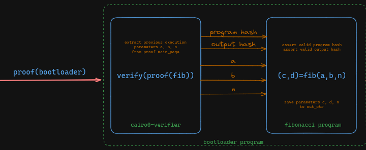
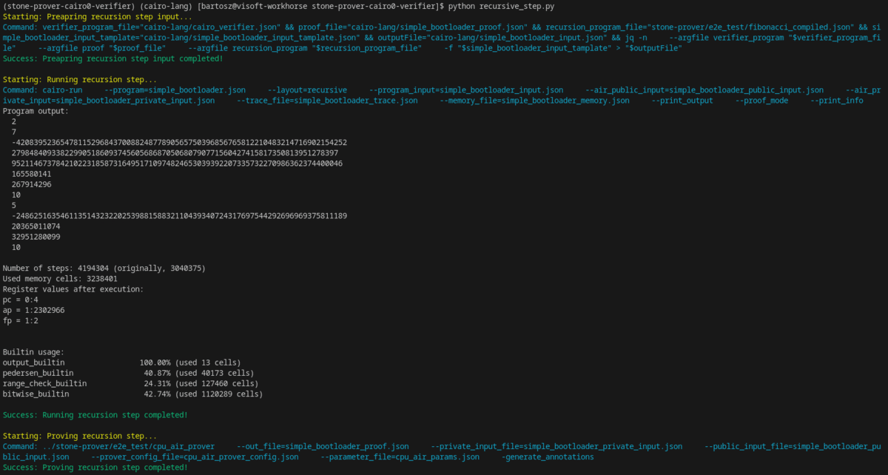

# Stone-Prover-Cairo0-Verifier

## Overview
This repository demonstrates how proofs generated by StoneProver can be verified using the Cairo0 verifier. It includes two submodules:
- [cairo-lang](https://github.com/Okm165/cairo-lang)
- [stone-prover](https://github.com/Okm165/stone-prover)



## Getting Started

### Clone the Repository
To get started, clone this repository and initialize its submodules:

```bash
git clone https://github.com/Okm165/stone-prover-cairo0-verifier.git
cd stone-prover-cairo0-verifier
git submodule update --init --recursive
git checkout --recurse-submodules recursive_poc_poseidon
```

### Setup env
```bash
pyenv activate stone-prover-cairo0-verifier
python setup.py
```

### Genesis step

```bash
python genesis_step.py
```

### Recursive step

```bash
python recursive_step.py
```



### Future Work and Enhancements

#### Version Compatibility:
An essential future direction is to ensure compatibility with newer versions of Cairo Lang and Cairo Verifier. This involves analyzing the changes between different versions and updating the repository to accommodate these changes.

#### Continuous Maintenance:
To remain a reliable reference, the repository will be regularly updated. This maintenance includes fixing bugs, improving documentation, and incorporating community feedback.
