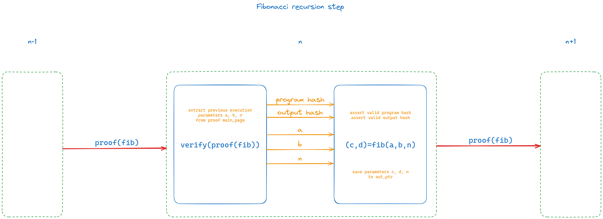

# Stone-Prover-Cairo0-Verifier

## Overview
This repository demonstrates how proofs generated by StoneProver can be verified using the Cairo0 verifier. It includes two submodules:
- [cairo-lang](https://github.com/Okm165/cairo-lang)
- [stone-prover](https://github.com/Okm165/stone-prover)



## Getting Started

### Clone the Repository
To get started, clone this repository and initialize its submodules:

```bash
git clone https://github.com/Okm165/stone-prover-cairo0-verifier.git
cd stone-prover-cairo0-verifier
git submodule update --init --recursive
```

### Install Cairo Lang
Install the Cairo language by executing the following commands:

```bash
cd cairo-lang
pip install --upgrade pip
zip -r cairo-lang-0.12.0.zip cairo-lang-0.12.0
pip install cairo-lang-0.12.0.zip
cd ../
```

### Build Stone-Prover
Build the StoneProver tool using Docker:

```bash
cd stone-prover
docker build --tag prover .
container_id=$(docker create prover)
docker cp -L ${container_id}:/bin/cpu_air_prover ./e2e_test
docker cp -L ${container_id}:/bin/cpu_air_verifier ./e2e_test
cd ../
```

## Usage

### Recursive POC

#### Genesis Proof
```bash
cd stone-prover/e2e_test
cairo-compile fibonacci.cairo --output fibonacci_compiled.json --proof_mode --no_debug_info
cairo-run \
    --program=fibonacci_compiled.json \
    --layout=recursive \
    --program_input=fibonacci_input.json \
    --air_public_input=fibonacci_public_input.json \
    --air_private_input=fibonacci_private_input.json \
    --trace_file=fibonacci_trace.json \
    --memory_file=fibonacci_memory.json \
    --print_output \
    --proof_mode
./cpu_air_prover \
    --out_file=fibonacci_proof.json \
    --private_input_file=fibonacci_private_input.json \
    --public_input_file=fibonacci_public_input.json \
    --prover_config_file=cpu_air_prover_config.json \
    --parameter_file=cpu_air_params.json \
    -generate_annotations
cd ../../
```

#### Compile Task programs & Bootloader
```bash
cd stone-prover/e2e_test
cairo-compile fibonacci.cairo --output fibonacci_compiled.json --proof_mode --no_debug_info
cd ../../
cd cairo-lang
cairo-compile --cairo_path=./src src/starkware/cairo/cairo_verifier/layouts/all_cairo/cairo_verifier.cairo --output cairo_verifier.json --proof_mode --no_debug_info
cairo-compile --cairo_path=./src src/starkware/cairo/bootloaders/simple_bootloader/simple_bootloader.cairo --output simple_bootloader.json --proof_mode --no_debug_info
cd ../
```

#### Prepare genesis recursion step
```bash
# Define file paths
verifier_program_file="cairo-lang/cairo_verifier.json"
proof_file="stone-prover/e2e_test/fibonacci_proof.json"
recursion_program_file="stone-prover/e2e_test/fibonacci_compiled.json"
simple_bootloader_input_tamplate="cairo-lang/simple_bootloader_input_tamplate.json"
outputFile="cairo-lang/simple_bootloader_input.json"

# Use jq to fill the template and save the result
jq -n \
    --argfile verifier_program "$verifier_program_file" \
    --argfile proof "$proof_file" \
    --argfile recursion_program "$recursion_program_file" \
    -f "$simple_bootloader_input_tamplate" > "$outputFile"
```

#### Run genesis recursion step
```bash
cd cairo-lang
cairo-run \
    --program=simple_bootloader.json \
    --layout=starknet_with_keccak \
    --program_input=simple_bootloader_input.json \
    --trace_file=simple_bootloader_trace.json \
    --memory_file=simple_bootloader_memory.json \
    --print_output
cd ../
```


### Future Work and Enhancements

#### Version Compatibility:
An essential future direction is to ensure compatibility with newer versions of Cairo Lang and Cairo Verifier. This involves analyzing the changes between different versions and updating the repository to accommodate these changes.

#### Continuous Maintenance:
To remain a reliable reference, the repository will be regularly updated. This maintenance includes fixing bugs, improving documentation, and incorporating community feedback.
